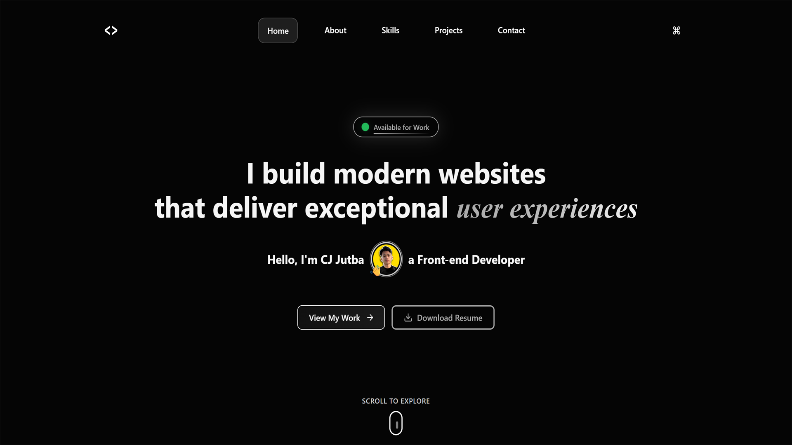

# Christian Jerald Jutba - Portfolio Website 

A modern, responsive portfolio website showcasing my work as a Frontend Developer. Built with React, TypeScript, and cutting-edge web technologies to deliver an exceptional user experience.

## 🌐 Live Demo

**[Visit Portfolio](https://cjjutba.site)**

## 📸 Preview

[](https://cjjutba.site)

## ✨ Features

### 🎨 Modern Design
- **Dark Theme**: Sleek, professional dark interface with custom color palette
- **Responsive Design**: Optimized for all devices (mobile, tablet, desktop)
- **Smooth Animations**: Powered by Framer Motion for fluid interactions
- **Interactive Elements**: Hover effects, transitions, and micro-interactions

### 🚀 Performance & UX
- **Fast Loading**: Optimized with Vite build system and code splitting
- **Progressive Enhancement**: Works without JavaScript, enhanced with it
- **Accessibility**: WCAG compliant with proper semantic HTML and ARIA labels
- **SEO Optimized**: Meta tags, structured data, and semantic markup

### 🛠️ Advanced Features
- **Command Palette**: Quick navigation with Cmd/Ctrl + K shortcut
- **Typewriter Effect**: Dynamic text animation in hero section
- **Scroll Indicators**: Visual progress tracking
- **Lazy Loading**: Optimized image loading for better performance
- **Email Integration**: Contact form powered by EmailJS

### 📱 Pages & Sections
- **Home**: Hero section, featured projects, tech stack, personal story
- **About**: Detailed background, experience, and professional journey
- **Skills**: Technical expertise with interactive visualizations
- **Projects**: Comprehensive project showcase with live demos
- **Contact**: Multiple ways to connect with integrated contact form

## 🛠️ Tech Stack

### Frontend
- **React 18** - Modern React with hooks and functional components
- **TypeScript** - Type-safe development with strict typing
- **Vite** - Lightning-fast build tool and development server
- **React Router DOM** - Client-side routing and navigation

### Styling & UI
- **Tailwind CSS** - Utility-first CSS framework
- **shadcn/ui** - High-quality, accessible UI components
- **Framer Motion** - Production-ready motion library
- **Lucide React** - Beautiful, customizable icons
- **React Icons** - Popular icon library integration

### Additional Libraries
- **EmailJS** - Client-side email service integration
- **Cobe** - Interactive 3D globe component
- **React Use Measure** - Element dimension tracking
- **Class Variance Authority** - Component variant management

### Development Tools
- **ESLint** - Code linting and quality assurance
- **TypeScript ESLint** - TypeScript-specific linting rules
- **PostCSS** - CSS processing and optimization
- **Autoprefixer** - Automatic vendor prefix handling

## 🏗️ Architecture & Implementation

This portfolio is built with modern web technologies and follows industry best practices for performance, accessibility, and user experience. The application features a component-based architecture with TypeScript for type safety and Tailwind CSS for consistent styling.

### Key Technical Decisions
- **React 18** with functional components and hooks for modern development
- **TypeScript** for enhanced code quality and developer experience
- **Vite** for fast development and optimized production builds
- **Tailwind CSS** with custom design system for consistent styling
- **Framer Motion** for smooth animations and micro-interactions

## 📁 Project Structure

```
src/
├── components/          # Reusable UI components
│   ├── layout/         # Navigation, footer, command palette
│   ├── sections/       # Page sections (hero, about, projects, etc.)
│   └── ui/            # Base UI components (buttons, animations, etc.)
├── data/              # Static data and content
│   └── projects/      # Project information and metadata
├── hooks/             # Custom React hooks
├── lib/               # Utility functions and configurations
├── pages/             # Main page components
├── styles/            # Global styles and CSS
└── types/             # TypeScript type definitions
```

## 🎯 Featured Projects

### 1. NexuStore - E-commerce Platform
- **Tech**: React, TypeScript, Tailwind CSS, shadcn/ui
- **Features**: 50+ products, shopping cart, responsive design
- **[Live Demo](https://nexustore-phi.vercel.app)** | **[GitHub](https://github.com/christianjeraldjutba/nexustore)**

### 2. WeatherDash - Weather Dashboard
- **Tech**: React, TypeScript, OpenWeatherMap API
- **Features**: Real-time data, 5-day forecast, PWA capabilities
- **[Live Demo](https://weather-dashboard-v1.vercel.app)** | **[GitHub](https://github.com/christianjeraldjutba/weatherdash)**

### 3. TaskFlow - Task Management
- **Tech**: React, TypeScript, Framer Motion
- **Features**: Kanban boards, drag-and-drop, analytics
- **[Live Demo](https://taskflow-web-app.vercel.app)** | **[GitHub](https://github.com/christianjeraldjutba/taskflow)**

## 🎨 Design System

### Color Palette
- **Background**: Deep black (#000000) with subtle gradients
- **Text**: High contrast white and gray tones
- **Accents**: Cyan (#00FFFF), Electric Blue (#1E90FF), Neon Green (#00FF85)
- **Interactive**: Smooth hover states and focus indicators

### Typography
- **Primary**: System fonts for optimal performance
- **Accent**: Playfair Display for elegant headings
- **Hierarchy**: Clear typographic scale with consistent spacing

### Animations
- **Entrance**: Staggered fade-ins with spring physics
- **Interactions**: Smooth hover and focus transitions
- **Scroll**: Parallax effects and scroll-triggered animations

## 📱 Responsive Breakpoints

- **Mobile**: 425px and below
- **Tablet**: 768px - 1023px
- **Laptop Small**: 1024px - 1279px
- **Laptop Medium**: 1280px - 1439px
- **Laptop Large**: 1440px and above

## 🔧 Configuration

### Technical Specifications
- **Email Integration**: Contact form powered by EmailJS for reliable message delivery
- **Performance Optimization**: Code splitting, lazy loading, and bundle optimization
- **Accessibility**: WCAG 2.1 AA compliant with proper semantic markup
- **Browser Support**: Modern browsers with graceful degradation for older versions

## 🚀 Deployment & Hosting

This portfolio is professionally deployed and optimized for production environments. The site is hosted on a custom domain with SSL certification and global CDN distribution for optimal performance worldwide.

### Production Features
- **Custom Domain**: Professional branding with cjjutba.site
- **SSL Certificate**: Secure HTTPS connection for all visitors
- **Global CDN**: Fast loading times across all geographic regions
- **Automatic Deployments**: Seamless updates and continuous integration

## 📈 Performance

- **Lighthouse Score**: 95+ across all metrics
- **Core Web Vitals**: Optimized for LCP, FID, and CLS
- **Bundle Size**: Optimized with code splitting and tree shaking
- **Image Optimization**: Lazy loading and modern formats

## 💼 Professional Inquiries

This portfolio represents my professional work and technical expertise as a Frontend Developer. For business inquiries, collaboration opportunities, or technical discussions, please feel free to reach out through the contact methods below.

## 📞 Contact

- **Website**: [cjjutba.site](https://cjjutba.site)
- **Email**: cjjutbaofficial@gmail.com
- **GitHub**: [@cjjutba](https://github.com/cjjutba)
- **LinkedIn**: [Christian Jerald Jutba](https://linkedin.com/in/cjjutba)

---

**Built with ❤️ by Christian Jerald Jutba**

*Frontend Developer passionate about creating exceptional user experiences*
